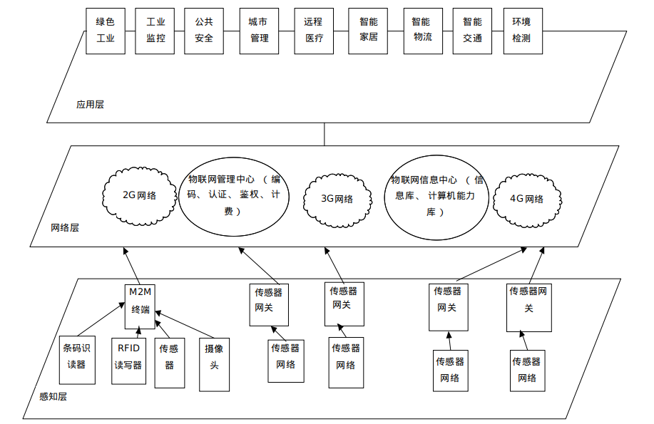

# 物联网的定义

> 在计算机互联网的基础上,利用射频识别技术、红外感应技术、传感器、无线数据通信技术，构造一个覆盖世界上万事万物的IOT－－物物相连的互联网络。

# 物联网与互联网的关系

- 物联网的核心和基础仍是互联网
- 用户端延伸和扩展到任何物品和物品之间，进行信息交换和通信

# 物联网系统的基本原理

- 利用标签对物体静态和动态的属性进行标识

- 识别设备对标签的物体属性进行标识

- 将物体的信息通过网络传输到信息处理中心，由处理中心完成物体信息的相关计算

  

- 感知层

  - 包括条码码标签和识读器、射频识别标签和读写器、摄像头、GPS、传感器、终端、传感器网络等设备或技术

- 网络层

  - 包括互联网、广电网络、通信网络等

- 应用层

  - 利用现有的智能手机、个人计算机（Personal Computer, PC）、掌上电脑（Personal Digital Assistant, PDA）等终端实现应用

# 物联网的发展现状

​	目前，许多发达国家将发展物联网视为新的经济增长点。据美国咨询研究机构Forrester预测，到2020年，物联网这一新兴产业将会发展成为一个上万亿规模的高科技市场，是目前互联网的30倍，而且将带来无数的就业机会。在未来，可以想象通过物物相连的庞大网络实现智能交通、智能安防、智能监控、智能物流以及家庭电器的智能化控制，将使生产和生活更加智能和便捷。

## 美国

```
	美国很多大学在无线传感器网络方面已开展了大量工作
	美国各大知名企业也都先后参与开展了无线传感器网络的研究
	在美国工商业领袖圆桌会上，把“宽带网络等新兴技术”定位为振兴经济、确立美国全球竞争优势的关键战略
```

## 欧盟

```
	2009年，欧盟执委会向欧盟议会、理事会、欧洲经济和社会委员会及地区委员会递交了《欧盟物联网行动计划》（Internet of Things -An action plan for Europe），以确保欧洲在物联网发展过程中起主导作用。
2009年10月，欧盟委员会以政策文件的形式对外发布了物联网战略，提出要让欧洲在基于互联网的智能基础设施发展上领先全球
	2011年至2013年间欧盟委员会每年新增2亿欧元进一步加强研发力度，同时拿出3亿欧元专款，支持物联网相关公私合作短期项目建设
```

## 中国

```
	物联网具备了一定的技术、产业和应用基础，呈现出良好的发展态势，但发展仍处于起步阶段
	2010年，研发了具有国际先进水平的光纤传感器，TD-LTE技术正在开展规模技术试验
	物联网在安防、电力、交通、物流、医疗、环保等领域已经得到应用，且应用模式正日趋成熟
	2011年正式发布的《物联网“十二五”发展规划》，明确了我国物联网发展的发展目标、主要任务、重点工程等
```

## 国内物联网发展的瓶颈

```
安全隐私保护问题
核心技术与标准有待突破
物联网产业政策欠缺
统一数据管理平台缺乏
行业应用有待提升
```

# 小结

- 物联网的概念及工作原理
- 物联网的体系架构
- 国内物联网发展的瓶颈


